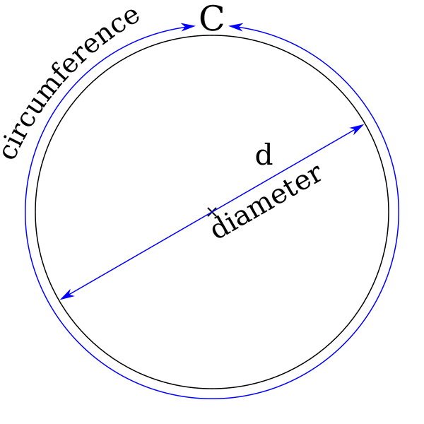
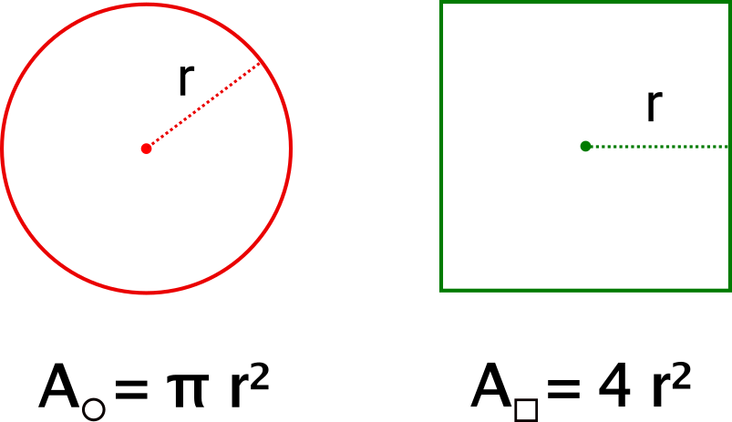
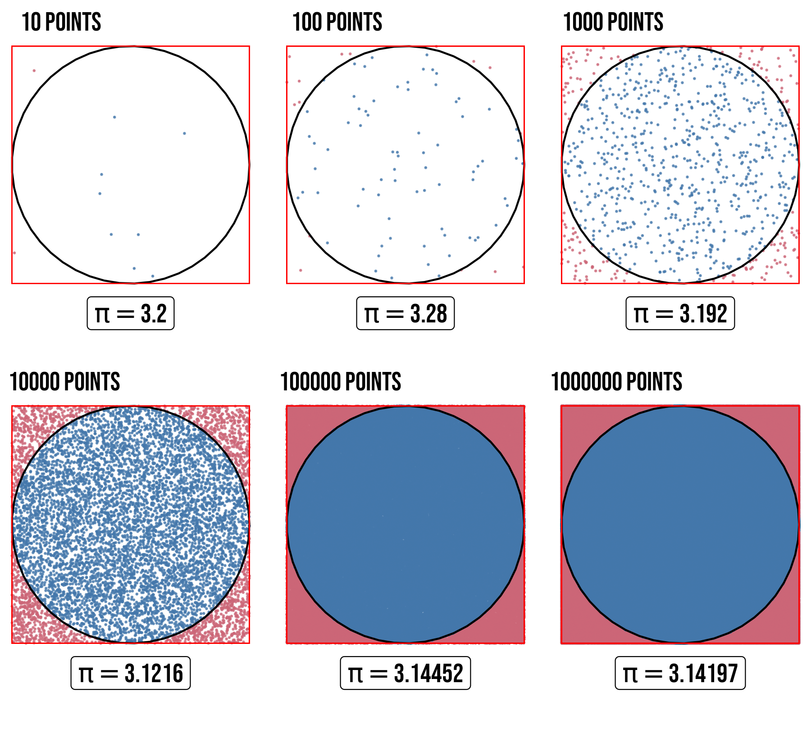
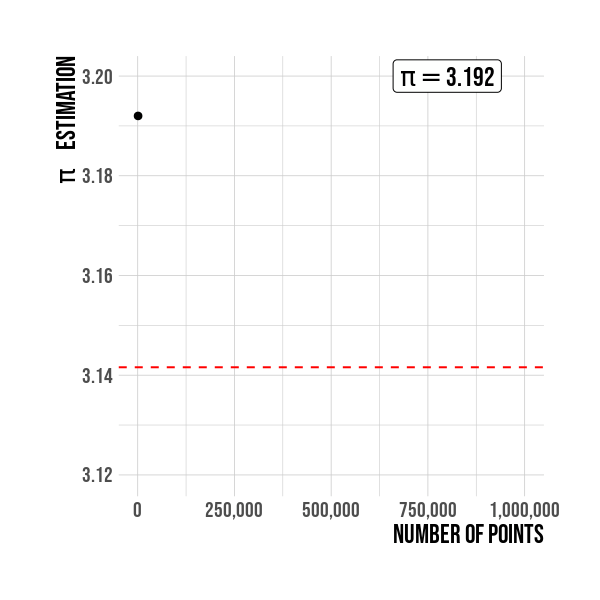

```{r setup, include=FALSE}
library(knitr) # A General-Purpose Package for Dynamic Report Generation in R
library(kableExtra) # Construct Complex Table with 'kable' and Pipe Syntax
library(vembedr) # Functions to Embed Video in HTML

# knitr::opts_chunk$set(collapse = TRUE, 
#                       warning=FALSE, message=FALSE)
knitr::opts_chunk$set(
  comment = "",
  message = FALSE,
  tidy = FALSE,
  cache = TRUE,
  warning = FALSE,
  encoding = "UTF-8",
  fig.align = 'center',
  fig.show = 'hold')
knitr::opts_knit$set(list(width = 80))
# Set margins
knitr::knit_hooks$set(small.mar = function(before, options, envir) {
  if (before) par(mar = c(4, 4, 1, 1))  # smaller margin on top and right
})
knitr::knit_hooks$set(no.mar = function(before, options, envir) {
  if (before) par(mar = c(0, 0, 0, 0))  # no margins
})
```

I always asked myself how the scientist have achieved a precise definition for this constant, I guess measuring the circumference with a string and dividing by its diameter is not the easiest way. For this reason in this post I want to show one of the multiples methods to estimate $\pi$, that using some animations made with `ggplot` and `gganimate`.


# Introduction 

We all know that the symbol used by mathematicians to represent the ratio of a circle's circumference to its diameter is the lowercase Greek letter $\pi$.

$$\pi =\frac{C}{d}$$
```{r piratio, echo=FALSE, out.width = "300px", fig.cap="The constant $\\pi$ is defined as the ratio between the circunference to its diamater. *Source: [Wikipedia](https://en.wikipedia.org/wiki/File:Pi_eq_C_over_d.svg)*."}

```
This ratio is constant, regardless of the circle's size. **pi** is perhaps the most famous of the irrational numbers, which means it can not be expressed as a common fraction converting it in an incommensurable number whose digits never settles into a permanently repeating pattern and appear to be randomly distributed.

Nowadays [31 trillon digits](https://www.npr.org/2019/03/14/703566696/the-woman-who-calculated-31-trillion-digits-of-pi) of $\pi$ are known, but do we need really this level of accuracy? NASA indeed has answered this question in a very interesting article I recommend you [*How Many Decimals of Pi Do We Really Need?*](https://www.jpl.nasa.gov/edu/news/2016/3/16/how-many-decimals-of-pi-do-we-really-need/).

# Monte Carlo method

Monte Carlo methods are a subset of computational algorithms that use the process of repeated random sampling to make numerical estimations of unknown parameters. To estimate $\pi$ the method consists of drawing on a canvas a square with an inner circle. As we know the area of the circle is $A_{\bigcirc} = \pi r^2$, and the area of the square is $A_{\square} = (2r)^2 = 4r^2$, see Figure \@ref(fig:squarecircle).


```{r squarecircle, echo=FALSE, out.width = "70%", fig.cap="Circle and square areas."}

```

As shown below dividing the area of the circle, by the area of the square we get $\pi /4$.

$$\frac{A_{\bigcirc}}{A_{\square}} = \frac{\pi \cancel{r^2}}{4 \cancel{r^2}} \Rightarrow \boxed{\pi = 4 \frac{A_{\bigcirc}}{A_{\square}}}$$
If a large number of random points inside the square is generated and the quantity of points inside the circle is counted.
We can use the following ratio to estimate Pi:

$$
\pi \approx 4 \frac{\text{number of points in the circle}}{\text{total number of points}}
$$
If you haven't understand the process yet the following video gives a very clear and didactic explanation about it, this will help you for sure.

```{r echo=FALSE, out.width="95%"}
embed_youtube("ELetCV_wX_c") %>% 
  use_align("center") %>% 
  use_bs_responsive
```

# Simulations: `r format(1000000, scientific = FALSE, big.mark = " ")` million points

To estimate $\pi$ we are going to plot randomly points using the `runif()` function and then count how many of them are inside the circle. The canvas in this case is the *x-y* plane, a square of side 2 units and an inner circle of radius 1 are plotted centered in the origin $(0,0)$. The number of points inside the circle satisfies the condition $\sqrt{x^{2}+y^{2}} \leq r$, where $r$ has to be 1 in our case, the radius of the unit circle. The idea now is to estimate $\pi$ as increasing the number of points, in the code below if the point falls inside the circle was assigned $1$ otherwise it is $0$. 

In figure \@ref(fig:facet-points), $\pi$ is estimated for 6 different simulations with different sample size to assess how the estimates vary. 

```{r facet-points, echo=FALSE, out.width = "80%", fig.cap="Estimation of $\\pi$ for different point quantities. Points are randomly scattered inside the square, some fall within the unit circle."}

```

Results for some values of $\pi$ are shown in the Table \@ref(tab:table-pi).

```{r table-pi, echo = FALSE, }
library(tidyverse) # Easily Install and Load the 'Tidyverse'
library(ggforce) # Accelerating 'ggplot2'
library(gganimate) # A Grammar of Animated Graphics
library(pals) # Color Palettes, Colormaps, and Tools to Evaluate Them
library(hrbrthemes) # Additional Themes, Theme Components and Utilities for 'ggplot2' 

set.seed(111)

### 1M random points over the canvas
random_points <-
  tibble(x = runif(1000000, min = -1, max = 1), 
         y = runif(1000000, min = -1, max = 1),
         r = ifelse(x^2 + y^2 <= 1, "in", 'out'))

random_points <-
  random_points %>% 
  mutate(n      = 1:n(),
         in_out = case_when(r == "in" ~ 1,
                            TRUE ~ 0),
         pi_est = 4*cumsum(in_out)/n,
         ten_pow = cut(n, breaks = 10^(0:6), labels = 10^(1:6), include.lowest = TRUE) %>% 
           as.character %>% as.numeric()) 

### Pi estimations to some powers of ten
options(scipen=10)

  random_points %>%
    group_by(ten_pow) %>%
    filter(row_number() == n()) %>%
    dplyr::select(ten_pow, pi_est) %>%
    kable(align="c", escape = F, caption = 'Some values of $\\pi$ estimated using numerical simulations.',
          col.names = c("Number of points", "Estimation of $\\pi$")) %>%
    kable_styling("striped", full_width = TRUE)
```

Figure \@ref(fig:simulation-animation) represents the same results shown previously but as an animation, this allow us to understand better the how pi accuracy increases as the sample size do same.

```{r simulation-animation, echo=FALSE, out.width = "80%", fig.cap="Numerical approximation of $\\pi$."}
knitr::include_graphics("animation_canvas.gif")
```

Figure below show `R` pi constant value as an horizontal <span style="color:red">red</span> line. It is seen the convergence to the constant pi is related with the sample size. A sample size of 1,000,000 is used for this simulation. 

```{r approx-animation, echo=FALSE, out.width = "80%", fig.cap="Estimation of $\\pi$ by sample size. The value is better as the sample points increases."}

```

> :warning: **NOTE**: For the curious people in `R` the $\pi$ number is defined by default up to 48 digits. 
> 
> **`r sprintf("%.48f",pi)`**

I hope this short post had been helpful to you. If you have any opinion, suggestion or critic all comments are received, please write me.

Until next time!

# Animations code

If you want to reproduce the images and the animations which I used in this post, the complete code can be found  [here](https://github.com/MauricioCely/utilities_R).


