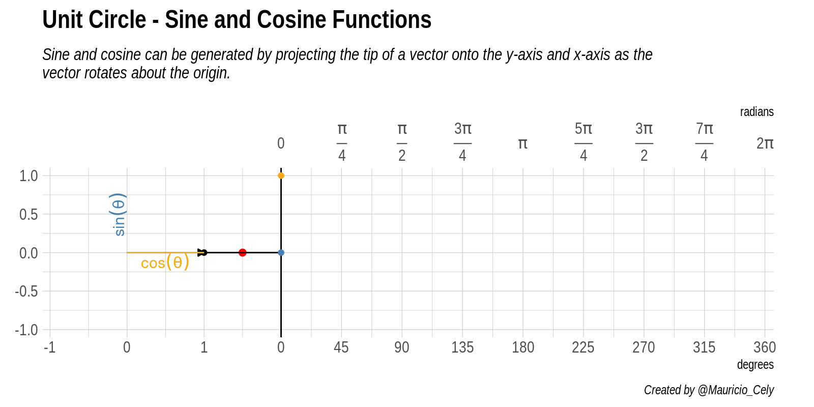

```{r setup, include=FALSE}
library(knitr)
library(kableExtra)
# knitr::opts_chunk$set(collapse = TRUE, 
#                       warning=FALSE, message=FALSE)
knitr::opts_chunk$set(
  comment = "",
  message = FALSE,
  tidy = FALSE,
  cache = TRUE,
  warning = FALSE,
  encoding = "UTF-8",
  fig.align = 'center',
  fig.show='hold')
knitr::opts_knit$set(list(width = 80))
# Set margins
knitr::knit_hooks$set(small.mar = function(before, options, envir) {
  if (before) par(mar = c(4, 4, 1, 1))  # smaller margin on top and right
})
knitr::knit_hooks$set(no.mar = function(before, options, envir) {
  if (before) par(mar = c(0, 0, 0, 0))  # no margins
})
```

Uno de los grandes paquete en R es `gganimate` creado por [Thomas Lin Pedersen](https://twitter.com/thomasp85). Y solo por diversión, vamos a emplearlo. Nuestro objetivo es crear un gráfico 2D simple y animado que represente la relación entre el Seno y el Coseno.

# Paquetes

Antes de comenzar, quiero mostrarles los paquetes empleados para la animación.

```{r align="center"}
library(tidyverse) # Easily Install and Load the 'Tidyverse' 
library(gganimate) # A Grammar of Animated Graphics
library(hrbrthemes) # Additional Themes, Theme Components and Utilities for 'ggplot2'
```

`tidyverse` es un paquete que reune varios paquetes de R (como `dpylr`, `purr`, `ggplot` entre otros) para manipular y visualizar datos. Por otro lado, `hrbrthemes` tiene un conjunto de temas para hacer que nuestros gráficos sean visualmente más agradable y así les demos un toque más elegante.

# Datos

El primer paso para elaborar nuestra animación será evaluar ambas funciones trigonométricas $\left( cos(\theta),sin(\theta) \right)$ en el ángulo $\theta$, para esto crearemos un conjunto de datos con una columna llamada `theta` que es una secuencia de $0$ a $2\pi$ con 100 elementos usando la función `seq()` y luego calcularemos los valores que toman seno y coseno para cada angulo y almacenamos los resultados en las columnas $y$ y $x$, respectivamente. 

```{r}
df <- 
  tibble(theta = seq(0, 2*pi, length.out = 100), ### Angle
         y     = sin(theta), ### y-component
         x     = cos(theta) ### x-component
         )
```

> Recordemos que en R los argumentos de las funciones `sin()` y `cos()` son en radianes, NO en grados.

Una mirada rapida de los datos nos permite ver que cuando $\theta$ es 0, el seno es 0 y el coseno es 1.

<div align="center">
```{r, echo=FALSE}
df %>% head() %>% 
  kable(align = "c") %>%
  kable_styling("striped", full_width = FALSE)

# {#id .class width=50% height=50%}
```
</div>

Para apreciar el comportamiento de cada función a continuación se grafican seno y coseno a medida que $\theta$ varia. 

```{r sine-cosine, fig.height=4, fig.width=9, fig.cap="Gráfica de las funciones seno y coseno en función de $\\theta$"}
ggplot(df) + 
  geom_line(aes(theta, x, color = "Cosine")) +
  geom_line(aes(theta, y, color = "Sine")) + 
  labs(x = "", y = "", color = "") +
  scale_color_manual(values = c("#FAAB18", "steelblue")) +
  coord_fixed() +
  theme_ipsum()
```

Se puede observar que ambas funciones toman valores entre $-1$ y $1$, aunque ambas oscilan de la misma manera parece que están *desplazadas* o mejor desfasadas horizontalmente una respecto a la otra. Siendo curiosos podríamos preguntarnos que ocurre si graficamos los valores de coseno en la abscisa y los del seno en la ordenada. ¡Voilà!, obtenemos como resultado un círculo.

```{r unit-circle, fig.cap="El círculo unitario."}
ggplot(df) + 
  geom_point(aes(x = x, y= y)) +
  labs(x = "", y = "") +
  coord_fixed() +
  theme_ipsum()
```

¿Que relación tienen las funciones Seno y Coseno con un círculo? Vamos a descubrirlo. Este círculo es conocido como **círculo unitario**, el cual tiene radio 1 y está centrado en el origen $(0,0)$ del sistema de *coordenadas cartesianas*. La importancia de este círculo radica en que hace que algunos temas de las matemáticas sean más fáciles y manejables. En el caso de la *trigonometría* para cualquier ángulo $\theta$, los valores para seno y coseno son nada más que $sin(\theta) = y$ y $cos(\theta) = x$.

Usando seno y coseno, es posible describir cualquier point $(x,y)$ como alternativa al punto $(r, \theta)$, donde $r$ es la longitud de un segmento de recta desde el origen hasta el punto y $\theta$ es el ángulo entre el segmento de recta y el eje x. Este es llamado el sitema de coordenadas polares y para convertir se emplea la relación $(x,y) = \left( rcos(\theta),rsin(\theta) \right)$. Si quieres comprender y ver mejor como es esta relación visita este [sitio](https://setosa.io/ev/sine-and-cosine/).

```{r circle-comp, fig.cap="Circulo unitario. Las componentes de cualquier punto $(x,y)$ sobre la circunferencia representan el coseno y seno del ángulo $\\theta$ que forma con la horizontal respectivamente"}
ggplot(df) + 
  geom_path(aes(x = x, y= y)) +
  geom_point(aes(x = cos(pi/4), y = sin(pi/4)), color = "red", size = 2) +
  geom_segment(aes(x = 0, y = 0, xend = cos(pi/4), yend = sin(pi/4)),
               arrow = arrow(length = unit(1.7, "mm"))) +
  geom_segment(aes(x = 0, y = sin(pi/4), xend = cos(pi/4), yend = sin(pi/4)),
               color = "#FAAB18") +
  geom_segment(aes(x = cos(pi/4), y = 0, xend = cos(pi/4), yend = sin(pi/4)),
               color = "steelblue") +
  geom_hline(yintercept = 0, linetype = 2) +
  geom_vline(xintercept = 0, linetype = 2) +
  labs(x = "", y = "") +
  coord_fixed() +
  theme_ipsum()
```

La tarea ahora consiste en combinar los gráficos del círculo y el seno y coseno. Al final del post encontrarás [código](#código) que empleé para crear la animación que ve en la Figura \@ref(fig:animacion).

```{r animacion, echo=FALSE, fig.cap="Animación de la relación entre el circulo unitario, seno y coseno"}

```

Partiendo del origen, la flecha recorre la circunferencia de radio 1 desde el eje horizontal completando un giro de 360 grados. Las componentes <span style="color:#FAAB18">*horizontal*</span> y <span style="color:steelblue">*vertical*</span> representan las funciones trigónometricas a medida que el ángulo varia, como se ve cuando una crece la otra decrece.


Si tomamos la proyección vertical del punto alrederor de nuestra circunferencia y lo proyectamos en línea recta (a lo largo del eje $y$) en el gráfico a la derecha del círculo. Esto nos lleva al punto <span style="color:red">*rojo*</span>. La coordenada $y$ de este punto rojo es el valor de la función seno evaluada en el ángulo $\theta$.

- Coordenada del punto que oscila verticalmente $y = sin(\theta)$

A medida que cambia el ángulo $\theta$, podemos ver que el punto rojo se mueve hacia arriba y hacia abajo, trazando el gráfico azul. Este es el gráfico para la función seno. Las líneas discontinuas que ves pasar marcan cada cuadrante a lo largo del círculo, es decir, en cada ángulo de $ 90°$ o $\pi/2$ radianes. Observa cómo la curva sinusoidal va de 1, a cero, a -1, luego vuelve a cero, exactamente en estas líneas. Esto refleja el hecho de que $sin(0) = 0$, $sin(\pi/2) = 1$, $sin(\pi) = 0$ y $sin(3\pi/2) = -1$.


Si seguimos el mismo razonamiento e imaginamos un punto proyectado paralelo a la coordenada $x$, es posible deducir el comportamiento de la función coseno evaluada en el ángulo $\theta$, es decir:

- Coordenada del punto que oscila horizontalmente $x = cos(\theta)$

La curva amarilla trazada por este punto imaginario es la gráfica de la función coseno. Observa nuevamente cómo se comporta cuando cruza cada cuadrante, reflejando el hecho de que $cos(0) = 1$, $cos(\pi/2) = 0$, $cos(\pi) = -1$ y $cos(3\pi/2) = 0$.

Ahora es tu momento de intentarlo. Espero que esta animación y breve explicación sobre el círculo unitario y la función seno y coseno te sean útiles. ¡Hasta la proxima!


# Código

Si prefieres puedes encontrar un script con el código completo  [aquí](https://github.com/MauricioCely/utilities_R).

```{r, eval=FALSE}
library(tidyverse) # Easily Install and Load the 'Tidyverse' 
library(gganimate) # A Grammar of Animated Graphics
library(hrbrthemes) # Additional Themes, Theme Components and Utilities for 'ggplot2'

df <- 
  tibble(theta = seq(0, 2*pi, length.out = 100), ### Angle
         x     = cos(theta), ### x-component
         y     = sin(theta) ### y-component
         )

### Add frame colum for each step of the animation
df <-
df %>%
  mutate(frame = 1:n()) %>%
  relocate(frame)

### Labels superior axis in radians
rad_labels <-  c(expression(phantom(over(1,1))*0*phantom(over(1,1))),
                       expression(frac(pi, 4)),
                       expression(frac(pi, 2)),
                       expression(frac(3*pi, 4)),
                       expression(phantom(over(1,1))*pi*phantom(over(1,1))),
                       expression(frac(5*pi, 4)),
                       expression(frac(3*pi, 2)),
                       expression(frac(7*pi, 4)),
                       expression(phantom(over(1,1))*2*pi*phantom(over(1,1)))
                 )


sine <- 
ggplot(df) + 
  ### Circle
  geom_point(aes(x, y)) +
  geom_path(aes(x, y)) +
  ### Angle arrow
  geom_segment(aes(x = 0, y = 0, xend = x, yend = y), arrow = arrow(length = unit(1.7, "mm"), type = "closed")) +
  geom_segment(aes(x = 2, y = 0, xend = Inf, yend = 0), linetype = "dashed") +
  ### Red point and its line
  geom_point(aes(x = 1.5, y = y), color = "red", size = 2) +
  geom_vline(xintercept = 2) +
  ### Connecting lines circle and functions
  geom_segment(aes(x = x, y = y, xend = theta + 2, yend = y)) +
  geom_segment(aes(x = 0, y = 0, xend = 0, yend = y), color = "steelblue") +
  geom_segment(aes(x = x, y = 0, xend = x, yend = y), color = "steelblue", linetype = 2) +
  geom_text(aes(x = -0.12, y = 0.5, label = "sin(theta)"), color = "steelblue", parse = T, angle = 90) +
  geom_segment(aes(x = 0, y = 0, xend = x, yend = 0), color = "#FAAB18") +
  geom_segment(aes(x = 0, y = y, xend = x, yend = y), color = "#FAAB18", linetype = 2) +
  geom_text(aes(x = 0.5, y = -0.12, label = "cos(theta)"), color = "#FAAB18", parse = T) +
  geom_path(aes(theta + 2, y), color = "steelblue") +
  geom_point(aes(x = theta + 2, y =  y), color = "steelblue") +
  geom_path(aes(theta + 2, x), color = "#FAAB18") +
  geom_point(aes(x = theta + 2, y =  x), color = "#FAAB18") +
  coord_fixed(expand = F, xlim = c(-1.1, 8.4), ylim = c(-1.1, 1.1)) +
  scale_x_continuous(breaks = c(-1:1, seq(2, (2*pi) + 2, length.out = 9)),
                     labels = c(-1:1, seq(0, 360, length.out = 9)), name = "degrees",
                     sec.axis = sec_axis(trans = ~.*1,
                                         breaks = c(rep(NA,3), seq(2, (2*pi)+2, length.out = 9)),
                                         labels =  c(-1:1, rad_labels),
                                         name =   "radians")) +
  labs(title = "Unit Circle - Sine and Cosine Functions",
       subtitle = "Sine and cosine can be generated by projecting the tip of a vector onto the y-axis and x-axis as the\n vector rotates about the origin.",
       caption = "Created by @Mauricio_Cely",
       y = "") +
  theme_ipsum() +
  theme(plot.margin = margin(-1, 1, -1, 0, unit = "cm"), 
        plot.subtitle = element_text(face = "italic")) +
  transition_reveal(along = frame)

# options(gganimate.dev_args = list(res = 115))

animate(sine,
        width = 1600, # 900px wide
        height = 800, # 600px high
        duration = 10,
        renderer = gifski_renderer(),
        res = 200) # 10 frames per second

anim_save("unit_circle.gif")
      
```

